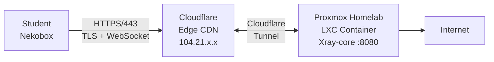

# 🚪 Project Janus — Bypassing Enterprise Firewalls with Traffic Obfuscation

[](https://opensource.org/licenses/MIT)
[](https://www.proxmox.com/)
[](https://github.com/XTLS/Xray-core)
[](https://developers.cloudflare.com/cloudflare-one/)

> **Named after Janus, the Roman god of doorways and passages** — this project opens doors through firewalls that were designed to keep them shut.

In Roman mythology, Janus was the god of doors, gates, and transitions. Janus represented the middle ground between both concrete and abstract dualities such as life/death, beginning/end, youth/adulthood, rural/urban, war/peace, and barbarism/civilization.

   

**Project Janus is a cybersecurity research project that demonstrates how to circumvent enterprise-grade network firewalls using traffic obfuscation, protocol tunneling, and domain fronting techniques.** Developed as part of an ASIR (Administración de Sistemas Informáticos y Redes) curriculum at IES Jaume I, Borriana (Spain).

---

## ⚠️ Disclaimer

This project is for **educational and research purposes only**. It was developed within an academic environment to understand firewall evasion techniques from a defensive security perspective. Understanding how attackers bypass network controls is essential for building better defenses.

**Do not use these techniques to violate network policies without authorization.**

---

## 🎯 Objective

The school network at IES Jaume I ("Aules") implements an enterprise firewall that restricts internet access. Project Janus aims to:

1. **Analyze** the firewall's filtering mechanisms through active reconnaissance
2. **Identify** weaknesses in the filtering strategy
3. **Exploit** those weaknesses using legitimate protocols and trusted infrastructure
4. **Document** the entire process as a learning resource for cybersecurity students

---

## 🔍 What We Discovered

Through systematic reconnaissance from inside the Aules network, we mapped the firewall's behavior:

| Target | Port 443 | Method |
|--------|----------|--------|
| AWS EC2 IPs | ❌ Blocked | IP range blocklist |
| Google Cloud IPs | ❌ Blocked | IP range blocklist |
| Oracle Cloud IPs | ❌ Blocked | IP range blocklist |
| Custom domains (nature46.uk) | ❌ Blocked | DNS-level filtering |
| **Cloudflare IPs** | ✅ Open | Trusted CDN provider |
| **Microsoft IPs** | ✅ Open | Trusted vendor |
| workers.dev / pages.dev | ✅ Open | Cloudflare subdomains |

**Key insight**: The firewall blocks cloud datacenter IP ranges but trusts CDN providers like Cloudflare. This creates a path through the firewall using Cloudflare as a trusted intermediary.

---

## 🏗️ Architecture

### Final Working Solution



### Protocol Stack

```
┌────────────────────────────────┐
│         VLESS Protocol         │  ← Lightweight proxy protocol
├────────────────────────────────┤
│        WebSocket (WS)          │  ← HTTP-compatible transport
├────────────────────────────────┤
│      TLS 1.3 (Cloudflare)      │  ← Encryption (handled by CF)
├────────────────────────────────┤
│          TCP / 443             │  ← Standard HTTPS port
└────────────────────────────────┘
```

### Why This Works

1. **IP Reputation**: Traffic goes to Cloudflare IPs (trusted CDN), not blocked datacenter IPs
2. **Protocol Compliance**: VLESS over WebSocket is indistinguishable from normal HTTPS/WebSocket traffic
3. **TLS Encryption**: Cloudflare provides valid TLS certificates — no DPI can inspect the payload
4. **No DNS dependency**: Client connects directly to Cloudflare IP with SNI header, bypassing DNS blocks
5. **No open ports**: Cloudflare Tunnel is an outbound connection from the homelab, CG-NAT is irrelevant

---

## 📚 Documentation

### Setup Guides

| Guide | Description |
|-------|-------------|
| [01 - Reconnaissance](docs/01-Reconnaissance.md) | Network analysis of the Aules firewall |
| [02 - Architecture](docs/02-Architecture.md) | Technical deep-dive into the protocol stack |
| [03 - AWS EC2 Setup](docs/03-AWS-EC2-Setup.md) | First approach: VLESS Reality on AWS (blocked at school) |
| [04 - Proxmox Homelab Setup](docs/04-Proxmox-Homelab-Setup.md) | Final solution: Xray + Cloudflare Tunnel |
| [05 - Client Configuration](docs/05-Client-Configuration.md) | Setting up Nekobox and V2RayN |
| [06 - Troubleshooting](docs/06-Troubleshooting.md) | Every problem we hit and how we solved it |

### Configuration Files

| File | Description |
|------|-------------|
| [xray-config.json](configs/xray-config.json) | Xray-core server configuration |
| [cloudflared-config.yml](configs/cloudflared-config.yml) | Cloudflare Tunnel ingress rules |
| [client-link.txt](configs/client-link.txt) | VLESS URI template for clients |

---

## 🛠️ Tech Stack

| Component | Role | Why |
|-----------|------|-----|
| **Proxmox VE** | Hypervisor | Lightweight LXC containers on low-power hardware |
| **Xray-core** | Proxy engine | VLESS + WebSocket, high performance |
| **3x-ui** | Management panel | Web GUI for clients, traffic stats |
| **Cloudflare Tunnel** | Ingress gateway | No port forwarding, trusted IPs |
| **Nekobox** | Linux client | TUN mode, system-wide proxy |
| **V2RayN** | Windows client | System proxy support |

---

## 📊 Evolution of the Project

```
Phase 1: AWS EC2 + VLESS Reality
├── ✅ Worked from home network
├── ❌ AWS IPs blocked at school
└── Learning: Cloud provider IPs are blocklisted on school firewalls

Phase 2: Proxmox Homelab + Cloudflare Tunnel ← FINAL
├── ✅ Cloudflare IPs trusted by firewall
├── ✅ Zero cost (Cloudflare free tier)
├── ✅ Low latency (~15ms, server in Spain, CDN in Madrid/Barcelona)
├── ✅ No ports open, CG-NAT irrelevant
└── ✅ Full control, multi-user support
```

---

## 🚀 Quick Start

```bash
# 1. Install Xray-core
bash <(curl -L https://github.com/XTLS/Xray-install/raw/main/install-release.sh)

# 2. Install 3x-ui panel
curl -Ls https://raw.githubusercontent.com/mhsanaei/3x-ui/master/install.sh | bash

# 3. Create VLESS + WebSocket inbound (port 8080, path /secretpath)

# 4. Set up Cloudflare Tunnel → your-server:8080

# 5. Import VLESS link in Nekobox/V2RayN and connect
```

See [docs/04-Proxmox-Homelab-Setup.md](docs/04-Proxmox-Homelab-Setup.md) for the full walkthrough.

---

## 📈 Cost Comparison

| Approach | Monthly Cost | Latency | Reliability |
|----------|-------------|---------|-------------|
| Commercial VPN | €5-12 | Variable | Often blocked |
| AWS EC2 Proxy | €8-15 | ~120ms | IP ranges blocked |
| **Proxmox + Cloudflare** | **€0** | **~15ms** | **Cloudflare IPs trusted** |

---

## 📄 License

MIT License. See [LICENSE](LICENSE) for details.

---

## 🙏 Acknowledgments

- **[Xray-core](https://github.com/XTLS/Xray-core)** — Proxy engine
- **[3x-ui](https://github.com/MHSanaei/3x-ui)** — Web management panel
- **[Cloudflare](https://www.cloudflare.com/)** — Free tunnel and CDN
- **[Proxmox](https://www.proxmox.com/)** — Virtualization platform

---

*Built with curiosity, persistence, and a lot of troubleshooting* 🔧
