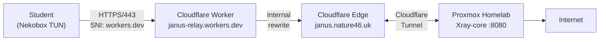

# 🚪 Project Janus — Bypassing Enterprise Firewalls with Traffic Obfuscation

[](https://opensource.org/licenses/MIT)
[](https://www.proxmox.com/)
[](https://github.com/XTLS/Xray-core)
[](https://developers.cloudflare.com/cloudflare-one/)

> **Named after Janus, the Roman god of doorways and passages** — this project opens doors through firewalls that were designed to keep them shut.


**Project Janus is a cybersecurity research project that demonstrates how to circumvent enterprise-grade network firewalls using traffic obfuscation, protocol tunneling, and CDN fronting techniques.** Developed as part of an ASIR (Administración de Sistemas Informáticos y Redes) curriculum at IES Jaume I, Borriana (Spain).

---

## ⚠️ Disclaimer

This project is for **educational and research purposes only**. It was developed within an academic environment to understand firewall evasion techniques from a defensive security perspective. Understanding how attackers bypass network controls is essential for building better defenses.

**Do not use these techniques to violate network policies without authorization.**

---

## 🎯 Objective

The school network at IES Jaume I ("Aules") implements a multi-layered enterprise firewall that heavily restricts internet access. Project Janus aims to:

1. **Analyze** the firewall's filtering mechanisms through active reconnaissance
2. **Identify** weaknesses in the filtering strategy
3. **Exploit** those weaknesses using legitimate protocols and trusted infrastructure
4. **Document** the entire process as a learning resource for cybersecurity students

---

## 🔍 What We Discovered

Through systematic reconnaissance from inside the Aules network, we mapped a **5-layer firewall model**:

### Layer 1: IP Blocklist

| Target | TCP 443 | Status |
|--------|---------|--------|
| Cloudflare (1.1.1.1) | ✅ OPEN | Trusted CDN |
| Cloudflare CDN (104.21.x.x) | ✅ OPEN | Trusted CDN |
| Microsoft (13.107.42.14) | ✅ OPEN | Trusted vendor |
| Microsoft Azure (20.70.246.20) | ✅ OPEN | Trusted vendor |
| AWS EC2 (3.230.166.65) | ❌ CLOSED | Cloud provider blocked |
| Google Cloud (142.250.185.206) | ❌ CLOSED | Cloud provider blocked |
| Oracle Cloud (129.151.40.1) | ❌ CLOSED | Cloud provider blocked |

### Layer 2: DNS Manipulation

| Domain | Result |
|--------|--------|
| nature46.uk | ❌ No response (blocked) |
| google.com | ⚠️ Redirected to `forcesafesearch.google.com` |
| reddit.com | ✅ Resolves (151.101.1.140) |
| workers.dev | ✅ Resolves (104.18.13.15) |
| youtube.com | ✅ Resolves (172.217.171.46) |
| anydesk.com | ✅ Resolves (104.18.31.170) |

### Layer 3: HTTPS/TLS Interception (Transparent Proxy)

**Every HTTPS request via curl returns HTTP 000** (connection killed), even to allowed IPs:

```
000  https://reddit.com
000  https://youtube.com
000  https://workers.dev
000  https://1.1.1.1
000  https://microsoft.com
000  https://google.com
```

A transparent proxy intercepts all HTTPS traffic at the application level.

### Layer 4: SNI Filtering

Connections with blocked SNI values are terminated (EOF after ~300ms):

```
nature46.uk     → EOF (blocked domain in SNI)
janus.nature46.uk → EOF (blocked domain in SNI)
```

Even connecting to a Cloudflare IP with `nature46.uk` in the SNI field fails.

### Layer 5: Port Filtering

| Port | Status | Protocol |
|------|--------|----------|
| 80 | ✅ OPEN | HTTP |
| 443 | ✅ OPEN | HTTPS (to allowed IPs) |
| 8080 | ✅ OPEN | HTTP Alternate |
| 8443 | ❌ CLOSED | HTTPS Alternate |
| 2053 | ❌ CLOSED | Custom |

### The Gap We Found

Despite all these layers, **raw TCP connections to Cloudflare IPs on port 443 succeed**. Applications that create direct TCP+TLS connections (like Nekobox in TUN mode) bypass the transparent proxy. Combined with an allowed SNI (`workers.dev`), the full connection chain works:

```
Nekobox (TUN) → TCP 443 → Cloudflare IP → TLS (SNI: workers.dev) → Worker → Tunnel → Home Server
```

---

## 🏗️ Architecture

### Final Working Solution



### Protocol Stack

```
┌────────────────────────────────┐
│         VLESS Protocol         │  ← Lightweight proxy protocol (UUID auth)
├────────────────────────────────┤
│        WebSocket (WS)          │  ← HTTP-compatible transport
├────────────────────────────────┤
│    TLS 1.3 (workers.dev SNI)   │  ← Allowed SNI bypasses filtering
├────────────────────────────────┤
│       TCP 443 (direct)         │  ← TUN mode bypasses transparent proxy
├────────────────────────────────┤
│     Cloudflare IP (trusted)    │  ← Passes IP blocklist
└────────────────────────────────┘
```

### Why This Works — Bypassing All 5 Layers

| Firewall Layer | How We Bypass It |
|----------------|------------------|
| **IP Blocklist** | Traffic goes to Cloudflare IPs (trusted, not blocked) |
| **DNS Filtering** | Client connects by IP, not domain name |
| **Transparent Proxy** | Nekobox TUN mode creates raw TCP, skipping the proxy |
| **SNI Filtering** | SNI is `workers.dev` (Cloudflare platform domain, allowed) |
| **Port Filtering** | Uses port 443 (standard HTTPS, always open) |

---

## 📚 Documentation

### Setup Guides

| Guide | Description |
|-------|-------------|
| [01 - Reconnaissance](docs/01-Reconnaissance.md) | Full network analysis of the Aules firewall with real test data |
| [02 - Architecture](docs/02-Architecture.md) | Technical deep-dive into each component and why it was chosen |
| [03 - AWS EC2 Setup](docs/03-AWS-EC2-Setup.md) | Alternative approach: VLESS Reality on AWS |
| [04 - Proxmox Homelab Setup](docs/04-Proxmox-Homelab-Setup.md) | Final solution: Xray + Cloudflare Tunnel + Worker |
| [05 - Client Configuration](docs/05-Client-Configuration.md) | Setting up Nekobox (Linux) and V2RayN (Windows) |
| [06 - Troubleshooting](docs/06-Troubleshooting.md) | Every problem we encountered and how we solved it |

### Configuration Files

| File | Description |
|------|-------------|
| [xray-config.json](configs/xray-config.json) | Xray-core VLESS + WebSocket server configuration |
| [cloudflared-config.yml](configs/cloudflared-config.yml) | Cloudflare Tunnel ingress configuration |
| [worker.js](configs/worker.js) | Cloudflare Worker code for SNI fronting |
| [client-link.txt](configs/client-link.txt) | VLESS URI templates for clients |

### Scripts

| Script | Description |
|--------|-------------|
| [recon.sh](scripts/recon.sh) | Network reconnaissance script for testing firewalls |

---

## 🛠️ Tech Stack

| Component | Role | Why |
|-----------|------|-----|
| **Proxmox VE** | Hypervisor | Lightweight LXC containers on low-power hardware |
| **Xray-core** | Proxy engine | VLESS + WebSocket, high performance |
| **3x-ui** | Management panel | Web GUI for client management and traffic stats |
| **Cloudflare Tunnel** | Ingress gateway | No port forwarding needed, outbound connection |
| **Cloudflare Worker** | SNI fronting | Rewrites requests with allowed `workers.dev` SNI |
| **Nekobox** | Linux client | TUN mode bypasses transparent proxy |
| **V2RayN** | Windows client | System proxy support |

---

## 📊 Evolution of the Project

```
Phase 1: AWS EC2 + VLESS Reality
├── ✅ Worked from home and school WiFi
├── ⚠️ AWS IPs blocked on some school networks
└── Learning: Cloud IP reputation varies by firewall config

Phase 2: Proxmox + Cloudflare Tunnel (direct)
├── ✅ Cloudflare IPs trusted by firewall
├── ❌ SNI filtering blocks nature46.uk in TLS handshake
└── Learning: Firewalls inspect SNI field in TLS ClientHello

Phase 3: Proxmox + Cloudflare Worker + Tunnel ← FINAL
├── ✅ Workers.dev SNI passes all filters
├── ✅ TUN mode bypasses transparent proxy
├── ✅ Zero cost (all free tier)
├── ✅ Multi-user support
└── ✅ Low latency (~15ms)
```

---

## 🚀 Quick Start

```bash
# 1. Install Xray-core on your server
bash <(curl -L https://github.com/XTLS/Xray-install/raw/main/install-release.sh)

# 2. Install 3x-ui panel
curl -Ls https://raw.githubusercontent.com/mhsanaei/3x-ui/master/install.sh | bash

# 3. Create VLESS + WebSocket inbound (port 8080, path /secretpath)

# 4. Set up Cloudflare Tunnel → your-server:8080

# 5. Create Cloudflare Worker for SNI fronting (see docs/04)

# 6. Import VLESS link in Nekobox (TUN mode) and connect
```

See [docs/04-Proxmox-Homelab-Setup.md](docs/04-Proxmox-Homelab-Setup.md) for the full walkthrough.

---

## 📈 Cost Comparison

| Approach | Monthly Cost | Latency | Bypasses SNI Filter |
|----------|-------------|---------|---------------------|
| Commercial VPN | €5-12 | Variable | Usually no |
| AWS EC2 Proxy | €8-15 | ~120ms | Yes (Reality) |
| **Proxmox + CF Worker** | **€0** | **~15ms** | **Yes (workers.dev SNI)** |

---

## 📄 License

MIT License. See [LICENSE](LICENSE) for details.

---

## 🙏 Acknowledgments

- **[Xray-core](https://github.com/XTLS/Xray-core)** — Proxy engine
- **[3x-ui](https://github.com/MHSanaei/3x-ui)** — Web management panel
- **[Cloudflare](https://www.cloudflare.com/)** — Tunnel, Workers, and CDN
- **[Proxmox](https://www.proxmox.com/)** — Virtualization platform

---

*Built with curiosity, persistence, and a lot of troubleshooting* 🔧
